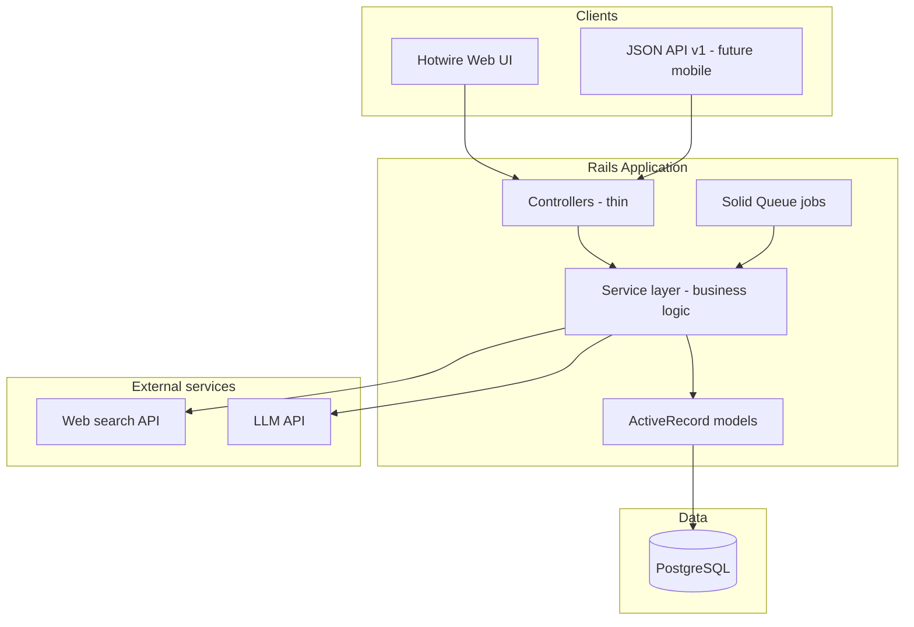
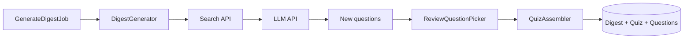
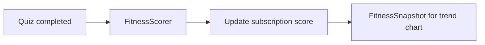
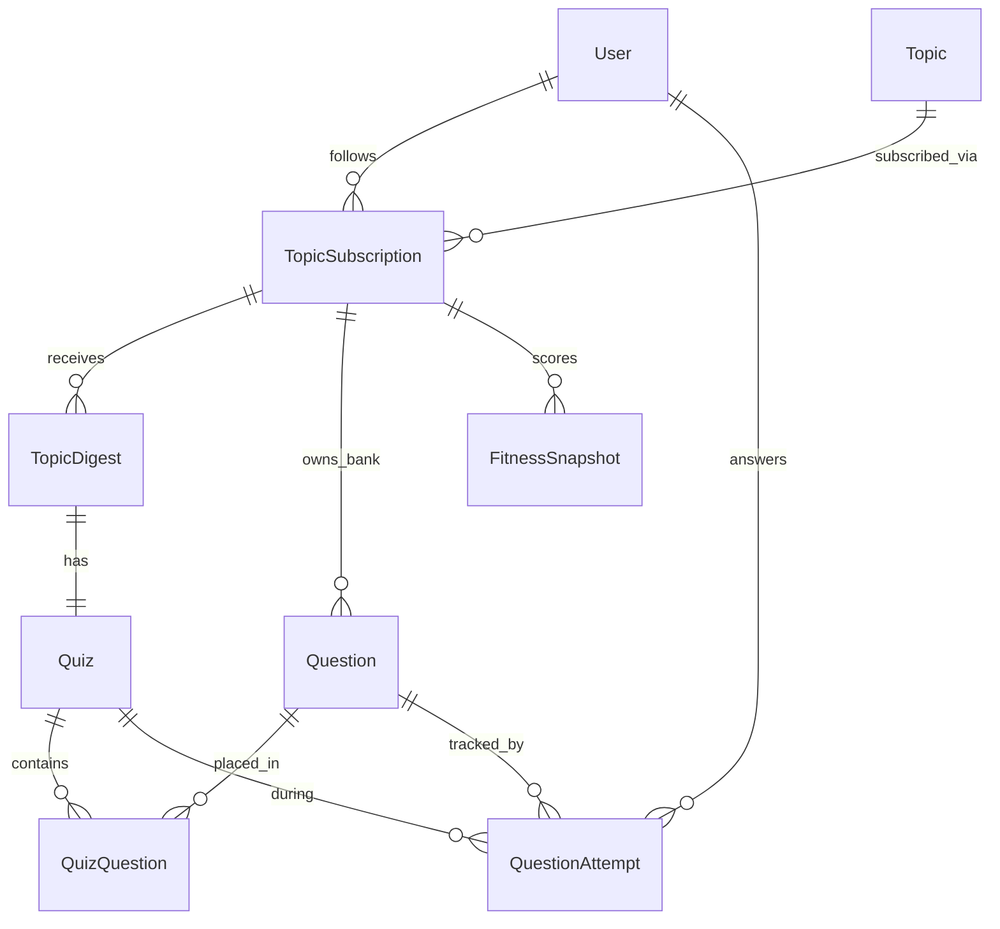

# Architecture

High-level map of Know The World — how the pieces fit together. For product requirements see [PRD.md](PRD.md). For behaviour in plain English see [domains/](domains/). For deferred optimisations see [TECH_DEBT.md](TECH_DEBT.md).

---

## What we're building

A Rails 8 full-stack app that helps users **build topic fitness** — lasting understanding of subjects they choose — through AI-generated briefings and quizzes. News and web content feed fresh material into topics; the app is not a daily headlines quiz.

**Core loop:** Follow topic → Read digest → Take quiz → Fitness score up → Repeat

---

## System overview



**Rule:** Controllers and jobs are thin. Business logic lives in `app/services/` and is shared by web UI and API.

---

## Content pipeline

How a digest and quiz get created (planned end-to-end flow):



| Step | Component | Status |
|---|---|---|
| 1 | `GenerateDigestJob` — triggered on subscribe or daily cron | Planned |
| 2 | `DigestGenerator` — search + LLM → briefing + new MCQs | Planned |
| 3 | `ReviewQuestionPicker` — ~30% review questions from bank | **Built** |
| 4 | `QuizAssembler` — combine new + review into one quiz | **Built** |
| 5 | Save to DB — `TopicDigest`, `Quiz`, `Question`, `QuizQuestion` | Planned |

After the user completes a quiz:



| Step | Component | Status |
|---|---|---|
| 1 | `FitnessScorer` — accuracy + consistency + retention | **Built** |
| 2 | Persist score + snapshot | Planned |

---

## Domain model



| Model | Role |
|---|---|
| `User` | Account (Rails 8 auth) |
| `Topic` | Subject — curated seed or custom |
| `TopicSubscription` | User following a topic (cadence, goal, fitness, streak) |
| `TopicDigest` | Briefing for one period (`digests` table) |
| `Quiz` | MCQ test for one digest |
| `Question` | MCQ bank entry per subscription |
| `QuizQuestion` | Join: position in quiz + `review` flag |
| `QuestionAttempt` | User's answer (drives scoring + review priority) |
| `FitnessSnapshot` | Daily score for trend charts |

> **Note:** The digest model class is `TopicDigest` (table `digests`) to avoid clashing with Ruby's stdlib `Digest`.

---

## Service layer

Services are the heart of the app. Each has a single public entry point: `.call(...)`.

| Service | Responsibility | Doc | Status |
|---|---|---|---|
| `FitnessScorer` | 0–100 score from accuracy, consistency, retention | [fitness_scorer.md](domains/fitness_scorer.md) | **Built** |
| `ReviewQuestionPicker` | Pick review questions from completed quiz history | [review_question_picker.md](domains/review_question_picker.md) | **Built** |
| `QuizAssembler` | Mix new + review questions (~70/30) | [quiz_assembler.md](domains/quiz_assembler.md) | **Built** |
| `DigestGenerator` | Search + LLM → digest + new questions | — | Planned |
| `RecordQuizCompletion` | Score quiz, persist fitness + snapshot | — | Planned |

External adapters (planned):

| Adapter | Role |
|---|---|
| `Search::Client` | Web search (Brave / Tavily) |
| `Llm::Client` | Digest synthesis + MCQ generation |

---

## Rails stack

| Layer | Technology |
|---|---|
| Framework | Rails 8.1, PostgreSQL |
| Web UI | Hotwire (Turbo + Stimulus), Propshaft |
| Background jobs | Solid Queue (`config/recurring.yml`) |
| Cache / Cable | Solid Cache, Solid Cable |
| Auth | Rails 8 authentication generator (planned) |
| API | `/api/v1/` namespace, Jbuilder (planned) |
| Deploy | Kamal + Docker |

---

## Layer responsibilities

```
app/
  controllers/          # HTTP: params in, delegate to services, render HTML or JSON
  controllers/api/v1/   # Same flows as web, JSON responses (planned)
  services/             # Business logic — test here first
  jobs/                 # Async triggers (cron, onboarding) — call services
  models/               # Data, validations, associations — keep thin
  views/                # Hotwire templates (planned)
```

**Controllers** instantiate one primary object where possible and delegate.  
**Jobs** enqueue work; they do not contain business rules.  
**Models** know about data integrity, not about LLMs or scoring formulas.

---

## Scheduled jobs (planned)

| Job | Schedule | Purpose |
|---|---|---|
| `DailyGenerationJob` | Daily ~5am | Find subscriptions due today; enqueue digest generation |
| `GenerateDigestJob` | On demand | Run full content pipeline for one subscription |

Subscriptions due when: cadence is daily, **or** cadence is weekly and today matches `weekly_on`.

---

## API surface (planned)

Parallel JSON API under `/api/v1/`, mirroring web flows:

- Sessions, topic subscriptions, digests, quizzes, quiz submission

Same services as the web UI — no duplicated business logic.

---

## Documentation map

| Doc | Purpose |
|---|---|
| [PRD.md](PRD.md) | Product requirements and v1 scope |
| **ARCHITECTURE.md** (this file) | High-level system map |
| [domains/](domains/) | Plain-English behaviour per service |
| [TECH_DEBT.md](TECH_DEBT.md) | Known scaling issues and deferred fixes |

---

## Implementation status

**Done**
- Domain models + migrations
- `FitnessScorer` + tests
- `ReviewQuestionPicker` + tests
- `QuizAssembler` + tests

**Next**
- `RecordQuizCompletion` → `DigestGenerator` → jobs → auth + UI

Update this section as major components land.
